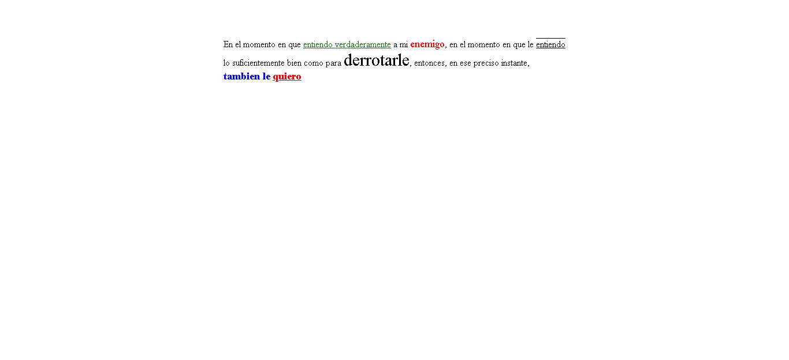

<h1>Taller 9 Andres Rodriguez</h1>

<h2>Informacion</h2>

Curso: Full Stack Basico -
Grupo 1

Profesor: Cristian Patiño 

<h2>Punto 1: Link de figma</h2>
<a href="https://www.figma.com/file/rcfAXrThQL81DQv7RkU2j2/Ricardo-Andres-Rodriguez-Mendez-Exercise-figma?type=design&node-id=0-1&t=cQZkDbmCK8makycp-0" target="_blank">Link de Figma</a>

 
<a href="https://94andresrodriguez.github.io/taller-9-full-stack/">Link pagina</a>

<h2>Punto 2:HTML</h2>

<h2>Punto 3:CSS</h2>

<h2>Punto 4:TITULOS</h2>

<h2>Punto 5:ESTILOS DE TEXTO</h2>

<h2>Punto 6:ENLACES</h2>
